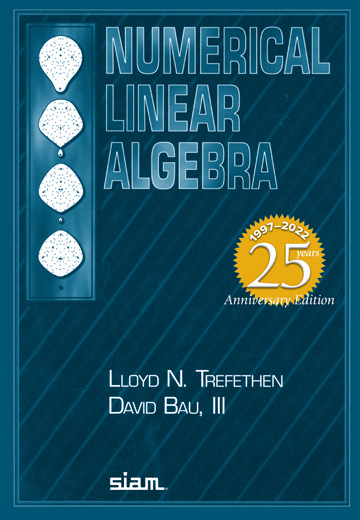

Welcome to the public homepage of **Math F614 Numerical Linear Algebra** in the [Dept. of Mathematics and Statistics](http://www.uaf.edu/dms/) at the [University of Alaska Fairbanks](http://www.uaf.edu/).

**UNDER CONSTRUCTION FOR Fall 2025!! MANY BAD LINKS FROM OLD COURSES!!**

If you plan to be present on campus in Fairbanks during the semester, please sign up for the in-person "901" section (crn 75513), and plan to attend lecture in Chapman 107.  If you are remote, signing up for the web-based "701" section (crn 75512) is just fine!

#### Instructor:  [Ed Bueler](http://bueler.github.io/)

Email me at [elbueler@alaska.edu](mailto:elbueler@alaska.edu).  I hold [office hours](http://bueler.github.io/OffHrs.htm) in Chapman 306C.

### Canvas course page

Log in to [canvas.alaska.edu/courses/15800](https://canvas.alaska.edu/courses/15800) for the lecture Zoom link, Homework and Exam solutions, and to see your grades.

### Getting Started

* Attend lectures: MWF 2:15-3:15pm in Chapman 107, or online.

* Read the [Syllabus (PDF)](assets/general/F23/syllabus.pdf).

* See the [Schedule (PDF)](assets/general/F23/schedule.pdf).  Check it often for due dates, and for which topics come next!

* Check out the nearly-weekly [homework Assignments](homework).

* There are three Exams, two Midterm Quizzes and a Final.  All are in class, and the Final will happen at the scheduled time.  See the [Exams](exams) tab for review guides.

* Homework will require programming in Matlab/Octave or some other suitable scientific computing language.  See the [this page](computing) and the [_Programming languages compared_ (PDF)](https://bueler.github.io/compareMOP.pdf) handout for recommended languages.  Code example are at the [Codes tab](codes).

* A very good free online textbook makes sense as a supplement: [Advanced Linear Algebra: Foundations to Frontiers](https://www.cs.utexas.edu/users/flame/laff/alaff/ALAFF.html).  Each section has a short online video.

* What are we studying?  Check out these Wikipedia pages for the topics we will get to, in this approximate order:

    * [matrix-vector and matrix-matrix multiplication](https://en.wikipedia.org/wiki/Matrix_multiplication)
    * [orthogonal matrices](https://en.wikipedia.org/wiki/Orthogonal_matrix)
    * [singular value decomposition](https://en.wikipedia.org/wiki/Singular_value_decomposition)
    * [QR factorization](https://en.wikipedia.org/wiki/QR_decomposition)
    * [least squares methods](https://en.wikipedia.org/wiki/Linear_least_squares)
    * [over- and under-determined linear systems](https://en.wikipedia.org/wiki/Overdetermined_system)
    * [conditioning of problems](https://en.wikipedia.org/wiki/Condition_number)
    * [backward stable algorithms](https://en.wikipedia.org/wiki/Numerical_stability)
    * [Gaussian elimination (LU factorization) and its variants](https://en.wikipedia.org/wiki/Gaussian_elimination)
    * [Cholesky factorization](https://en.wikipedia.org/wiki/Cholesky_decomposition)
    * [power iteration for eigenvalues](https://en.wikipedia.org/wiki/Power_iteration), an important and impractical method
    * [QR algorithm for eigenvalues](https://en.wikipedia.org/wiki/QR_algorithm), very practical
    * [Krylov subspace iterations](https://en.wikipedia.org/wiki/Krylov_subspace)

---
_Site design derived from [coordinated Calc I](https://uaf-math.github.io/calc1/), an original [Jekyll](https://jekyllrb.com/) design by [David Maxwell](https://damaxwell.github.io/)._

